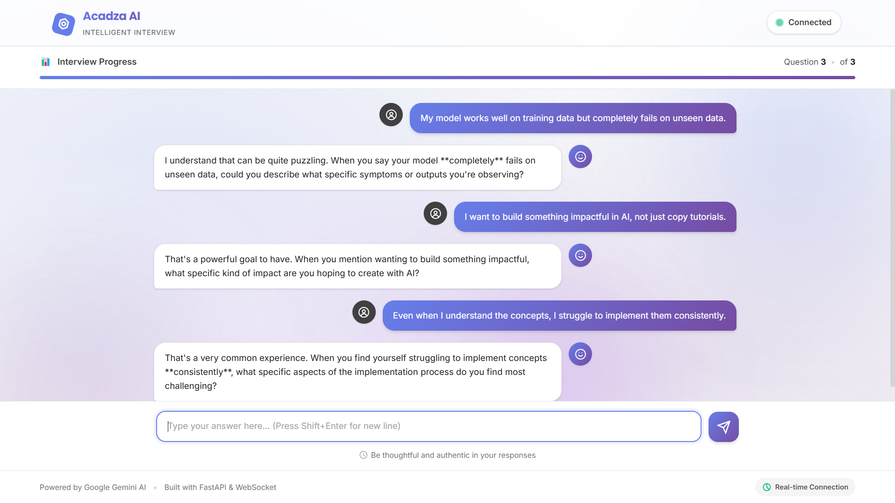
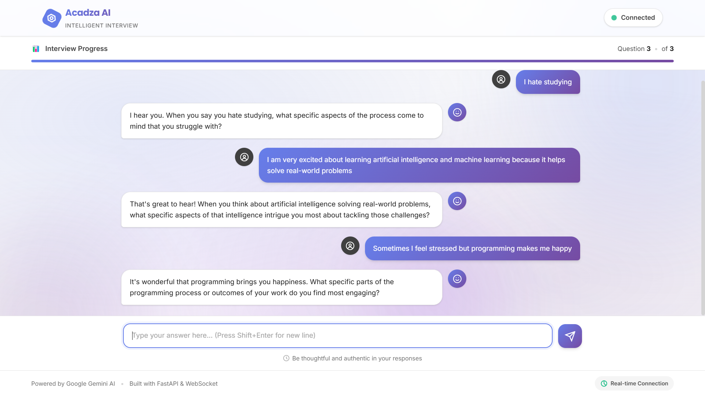
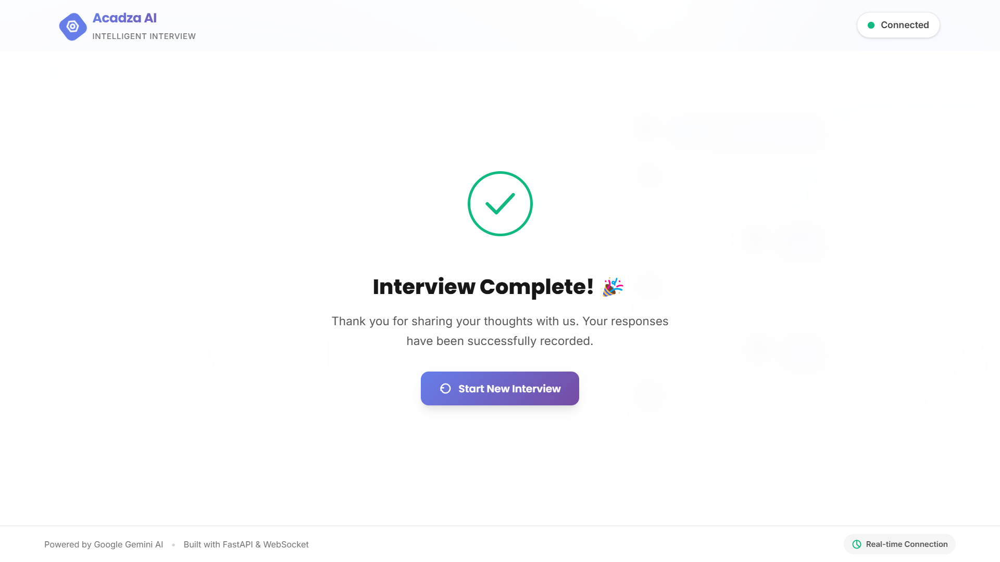

# 🤖 Acadza AI Interview - WebSocket Assignment

A real-time AI-powered conversational interview application built with **FastAPI**, **WebSocket**, and **Google Gemini AI**. The application conducts intelligent follow-up interviews by generating contextual questions that include exact keywords from user responses.

[](https://www.python.org/)
[](https://fastapi.tiangolo.com/)
[](https://developer.mozilla.org/en-US/docs/Web/API/WebSocket)
[](https://ai.google.dev/)
[](LICENSE)

---

## 📋 Table of Contents

- [Features](#-features)
- [Technology Stack](#-technology-stack)
- [Demo Screenshots](#-demo-screenshots)
- [Installation & Setup](#-installation--setup)
- [Usage](#-usage)
- [Project Structure](#-project-structure)
- [API Documentation](#-api-documentation)
- [Assignment Requirements](#-assignment-requirements)
- [Deployment](#-deployment)
- [Contributing](#-contributing)
- [License](#-license)
- [Author](#-author)
- [Acknowledgments](#-acknowledgments)

---

## ✨ Features

### Core Functionality
- **Real-time WebSocket Communication** - Bidirectional, low-latency message exchange
- **AI-Powered Follow-ups** - Google Gemini 2.5 Flash generates contextual questions
- **Keyword Extraction** - Intelligent filtering of stop words to extract meaningful keywords
- **Exact Word Matching** - Every AI question includes at least one word from the user's previous response
- **Conversation State Management** - Tracks conversation flow and progress
- **Error Handling** - Graceful fallbacks and comprehensive error messages

### User Experience
- **Modern, Responsive UI** - Clean design with smooth animations
- **Progress Tracking** - Visual progress bar showing interview completion
- **Real-time Status Indicator** - Connection status with auto-reconnection
- **Auto-scroll Chat** - Smooth scrolling to latest messages
- **Typing Indicators** - Visual feedback while AI generates responses
- **Completion Screen** - Professional end-of-interview confirmation

---

## 🛠 Technology Stack

### Backend
- **FastAPI** - High-performance Python web framework
- **WebSocket** - Real-time bidirectional communication protocol
- **Google Gemini AI** - Advanced language model (gemini-2.5-flash)
- **Python 3.10+** - Core programming language
- **Uvicorn** - ASGI server for production deployment
- **python-dotenv** - Environment variable management

### Frontend
- **HTML5** - Semantic markup structure
- **CSS3** - Modern styling with animations and gradients
- **Vanilla JavaScript** - WebSocket client and DOM manipulation
- **Google Fonts (Inter)** - Professional typography

### Development Tools
- **VS Code** - Primary development environment
- **Git** - Version control
- **Virtual Environment** - Isolated Python dependencies

---

## 📸 Demo Screenshots

### Welcome Screen

*Clean, professional welcome interface with input validation*

### Chat Conversation

*Real-time AI-powered follow-up questions with keyword matching*

### Completion Screen

*Professional completion message with restart option*

---

## 🚀 Installation & Setup

### Prerequisites
- Python 3.10 or higher
- Google Gemini API Key ([Get it here](https://makersuite.google.com/app/apikey))
- Git (optional, for cloning)

### Step 1: Clone or Download Repository
```bash
git clone https://github.com/amanraj74/acadza-websocket-ai.git
cd acadza-websocket-ai
```

### Step 2: Backend Setup
```bash
cd backend

# Create virtual environment
python -m venv venv

# Activate virtual environment
# On Windows:
venv\Scripts\activate
# On Mac/Linux:
source venv/bin/activate

# Install dependencies
pip install -r requirements.txt
```

### Step 3: Environment Configuration
Create a `.env` file in the `backend` folder:

```env
GEMINI_API_KEY=your_gemini_api_key_here
```

### Step 4: Run Backend Server
```bash
python main.py
```
Server will start at: `http://localhost:8000`

### Step 5: Run Frontend
Open `frontend/index.html` in your browser, or use a local server:

**Option A - Direct File:**
1. Navigate to `frontend/` folder
2. Double-click `index.html`

**Option B - Live Server (Recommended):**
1. Install VS Code "Live Server" extension
2. Right-click `index.html` → "Open with Live Server"

---

## 💡 Usage

### Start the Application
1. Ensure backend is running on port 8000
2. Open frontend in browser
3. Check "Connected" status (green indicator)

### Begin Interview
1. Enter a sentence in the input box (e.g., "I love coding")
2. Click "Launch Interview"

### Answer Follow-ups
1. AI will ask 3 intelligent follow-up questions
2. Each question will contain a keyword from your previous response
3. Type your answer and press Enter or click Send

### Completion
1. After 3 questions, see confirmation: "Thanks, we have got your data."
2. Click "Start New Interview" to begin again

---

## 📁 Project Structure

```
acadza-websocket-ai/
│
├── backend/
│   ├── main.py                 # FastAPI server with WebSocket endpoint
│   ├── requirements.txt        # Python dependencies
│   ├── .env                    # Environment variables (API key)
│   └── venv/                   # Virtual environment (not in Git)
│
├── frontend/
│   ├── index.html              # Main HTML structure
│   ├── style.css               # Professional styling and animations
│   └── script.js               # WebSocket client logic
│
├── screenshots/
│   ├── 1-.png
│   ├── 2-.png
│   └── 3-.png
│
├── README.md                   # This file
└── .gitignore                  # Git ignore rules
```

---

## 📡 API Documentation

### WebSocket Endpoint
**URL:** `ws://localhost:8000/ws`

### Message Types

#### 1. Initial Message (Client → Server)
```json
{
  "type": "initial",
  "message": "User's initial sentence"
}
```

#### 2. Answer Message (Client → Server)
```json
{
  "type": "answer",
  "message": "User's answer to follow-up"
}
```

#### 3. Follow-up Response (Server → Client)
```json
{
  "type": "follow_up",
  "question": "AI-generated follow-up question",
  "number": 1,
  "total": 3
}
```

#### 4. Completion Response (Server → Client)
```json
{
  "type": "complete",
  "message": "Thanks, we have got your data."
}
```

#### 5. Error Response (Server → Client)
```json
{
  "type": "error",
  "message": "Error description"
}
```

### REST Endpoint

**Health Check:** `GET http://localhost:8000/`

**Response:**
```json
{
  "status": "active",
  "message": "Acadza WebSocket AI Server is running",
  "version": "1.0.0",
  "model": "gemini-2.5-flash"
}
```

---

## ✅ Assignment Requirements

This project fulfills all Acadza internship assignment requirements:

- [x] **WebSocket Implementation** - Real-time bidirectional communication
- [x] **AI Integration** - Google Gemini API for intelligent responses
- [x] **Keyword Extraction** - Filters stop words and extracts meaningful terms
- [x] **Exact Word Matching** - Every follow-up contains user's keywords
- [x] **3 Follow-up Questions** - Structured conversation flow
- [x] **Professional UI/UX** - Modern, responsive interface
- [x] **Error Handling** - Comprehensive error management
- [x] **Documentation** - Complete README with setup instructions
- [x] **Code Quality** - Clean, maintainable, well-commented code

---

## 🤝 Contributing

Contributions are welcome! Please follow these steps:

1. Fork the repository
2. Create a feature branch (`git checkout -b feature/AmazingFeature`)
3. Commit changes (`git commit -m 'Add AmazingFeature'`)
4. Push to branch (`git push origin feature/AmazingFeature`)
5. Open a Pull Request

### Contribution Guidelines
- Follow PEP 8 for Python code
- Write clear, descriptive commit messages
- Add comments for complex logic
- Update documentation for new features
- Test thoroughly before submitting PR

---

## 📄 License

This project is created as part of the Acadza internship assignment.

```
MIT License

Copyright (c) 2026 [Aman Jaiswal]

Permission is hereby granted, free of charge, to any person obtaining a copy
of this software and associated documentation files (the "Software"), to deal
in the Software without restriction, including without limitation the rights
to use, copy, modify, merge, publish, distribute, sublicense, and/or sell
copies of the Software, and to permit persons to whom the Software is
furnished to do so, subject to the following conditions:

The above copyright notice and this permission notice shall be included in all
copies or substantial portions of the Software.

THE SOFTWARE IS PROVIDED "AS IS", WITHOUT WARRANTY OF ANY KIND, EXPRESS OR
IMPLIED, INCLUDING BUT NOT LIMITED TO THE WARRANTIES OF MERCHANTABILITY,
FITNESS FOR A PARTICULAR PURPOSE AND NONINFRINGEMENT. IN NO EVENT SHALL THE
AUTHORS OR COPYRIGHT HOLDERS BE LIABLE FOR ANY CLAIM, DAMAGES OR OTHER
LIABILITY, WHETHER IN AN ACTION OF CONTRACT, TORT OR OTHERWISE, ARISING FROM,
OUT OF OR IN CONNECTION WITH THE SOFTWARE OR THE USE OR OTHER DEALINGS IN THE
SOFTWARE.
```

---

## 👨‍💻 Author

**[Aman Jaiswal]**

- 🌐 GitHub: [amanraj74](https://github.com/amanraj74)
- 💼 LinkedIn: [Aman Jaiswal](https://www.linkedin.com/in/aman-jaiswal-05b962212/)
- 📧 Email: aerraj50@gmail.com
---

## 📋 Assignment Details

- **Submitted To:** Acadza HR Team
- **Status:** ✅ Completed

---

## 🙏 Acknowledgments

- **Google Gemini AI** - For providing the powerful language model
- **FastAPI** - For the excellent web framework and WebSocket support
- **Acadza** - For the opportunity and challenging assignment
- **Open Source Community** - For the amazing tools and libraries

---

## 📞 Support

For questions or issues:

1. Check the [Issues](https://github.com/amanraj74/acadza-websocket-ai/issues) page
2. Create a new issue with detailed description
3. Contact: aerraj50@gmail.com

---

## 🔗 Quick Links

- [FastAPI Documentation](https://fastapi.tiangolo.com/)
- [WebSocket API Guide](https://developer.mozilla.org/en-US/docs/Web/API/WebSocket)
- [Google Gemini AI](https://ai.google.dev/)
- [Python Documentation](https://docs.python.org/3/)

---

## 📊 Project Stats

- **Lines of Code:** ~500+ (Backend + Frontend)
- **Development Time:** 4 days
- **Technologies Used:** 6+ (Python, FastAPI, JavaScript, WebSocket, Gemini AI, HTML/CSS)
- **API Calls:** Real-time WebSocket + Gemini AI
- **Response Time:** <100ms (WebSocket latency)

---

<div align="center">

**Built with ❤️ for Acadza Internship Assignment**

⭐ If you found this project helpful, please give it a star!

</div>
